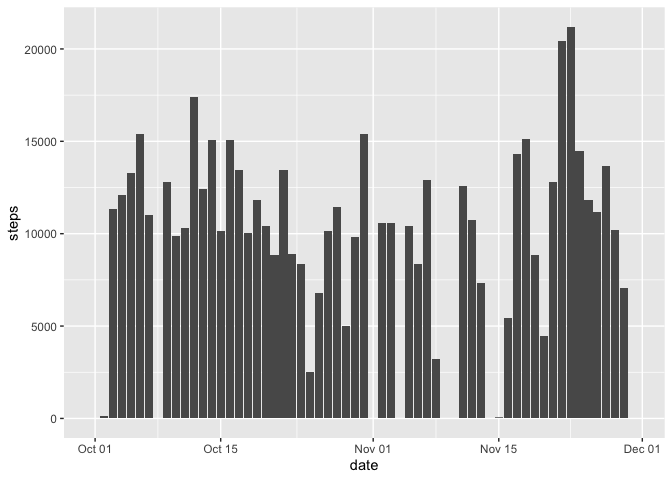
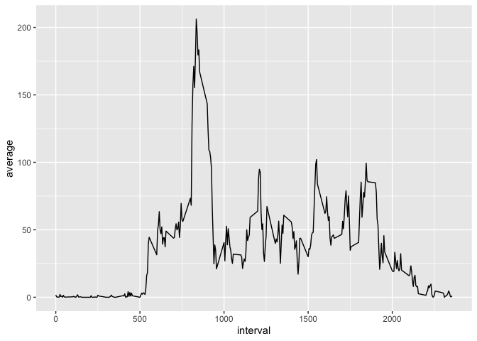
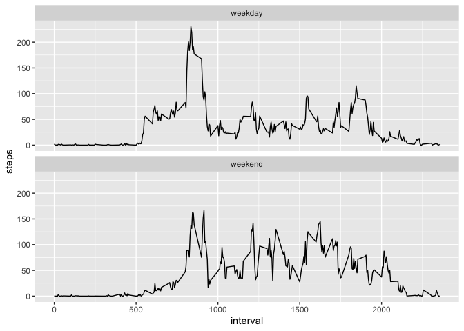

## Loading and preprocessing the data


```r
library(dplyr)
```

```
## 
## Attaching package: 'dplyr'
```

```
## The following objects are masked from 'package:stats':
## 
##     filter, lag
```

```
## The following objects are masked from 'package:base':
## 
##     intersect, setdiff, setequal, union
```

```r
library(tidyr)
library(ggplot2)

df <- read.csv('activity.csv')
df <- df %>% 
    mutate(
        date = as.Date(date)
    )
head(df)
```

```
##   steps       date interval
## 1    NA 2012-10-01        0
## 2    NA 2012-10-01        5
## 3    NA 2012-10-01       10
## 4    NA 2012-10-01       15
## 5    NA 2012-10-01       20
## 6    NA 2012-10-01       25
```

------------------------------------------------------------------------

## What is mean total number of steps taken per day?

### 1. Calculate the total number of steps taken per day


```r
total_number_of_step_per_day <- df %>% 
    group_by(date) %>% 
    summarise(
        steps = sum(steps)
    ) %>% 
    mutate(
        steps = ifelse(is.na(steps), 0, steps)
    )
head(total_number_of_step_per_day)
```

```
## # A tibble: 6 × 2
##   date       steps
##   <date>     <dbl>
## 1 2012-10-01     0
## 2 2012-10-02   126
## 3 2012-10-03 11352
## 4 2012-10-04 12116
## 5 2012-10-05 13294
## 6 2012-10-06 15420
```

### 2. If you do not understand the difference between a histogram and a barplot, research the difference between them. Make a histogram of the total number of steps taken each day


```r
ggplot(total_number_of_step_per_day, aes(x=date, y=steps)) +
    geom_histogram(stat='identity')
```

```
## Warning: Ignoring unknown parameters: binwidth, bins, pad
```

<!-- -->

### 3. Calculate and report the mean and median of the total number of steps taken per day


```r
total_number_of_step_per_day %>% 
    summarise(
        mean = mean(steps),
        median = median(steps)
    )
```

```
## # A tibble: 1 × 2
##    mean median
##   <dbl>  <dbl>
## 1 9354.  10395
```

#### Answer

The mean and median of the total number of steps taken per day are **9354.23** and **10395**.

------------------------------------------------------------------------

## What is the average daily activity pattern?

### Make a time series plot (i.e. type = "l"type = "l") of the 5-minute interval (x-axis) and the average number of steps taken, averaged across all days (y-axis)


```r
average_number_of_steps_taken <- df %>% 
    group_by(interval) %>% 
    summarise(
        average = mean(steps, na.rm=TRUE)
    )

ggplot(average_number_of_steps_taken, aes(x=interval, y=average)) +
    geom_line()
```

<!-- -->

### Which 5-minute interval, on average across all the days in the dataset, contains the maximum number of steps?


```r
average_number_of_steps_taken %>% 
    filter(average == max(average, na.rm=TRUE))
```

```
## # A tibble: 1 × 2
##   interval average
##      <int>   <dbl>
## 1      835    206.
```

#### Answer

The interval equals to **835** contains the maximum number of steps.

------------------------------------------------------------------------

## Imputing missing values

### 1. Calculate and report the total number of missing values in the dataset (i.e. the total number of rows with NANAs)


```r
df %>% 
    summarise(
        missing_steps = sum(is.na(steps)),
        missing_date = sum(is.na(date)),
        missing_interval = sum(is.na(interval))
    )
```

```
##   missing_steps missing_date missing_interval
## 1          2304            0                0
```

#### Answer

There are 2304 missing values in the dataset.

### 2. Devise a strategy for filling in all of the missing values in the dataset. The strategy does not need to be sophisticated. For example, you could use the mean/median for that day, or the mean for that 5-minute interval, etc.


```r
for (i in 1:nrow(df)) {
    if(is.na(df[i, ]$steps)) {
        df[i, ]$steps <- average_number_of_steps_taken[average_number_of_steps_taken$interval == df[i, ]$interval, ]$average
    }
}
```

### 3. Create a new dataset that is equal to the original dataset but with the missing data filled in.


```r
head(df)
```

```
##       steps       date interval
## 1 1.7169811 2012-10-01        0
## 2 0.3396226 2012-10-01        5
## 3 0.1320755 2012-10-01       10
## 4 0.1509434 2012-10-01       15
## 5 0.0754717 2012-10-01       20
## 6 2.0943396 2012-10-01       25
```

### 4. Make a histogram of the total number of steps taken each day and Calculate and report the **mean** and **median** total number of steps taken per day. Do these values differ from the estimates from the first part of the assignment? What is the impact of imputing missing data on the estimates of the total daily number of steps?

#### histogram


```r
total_number_of_steps_taken_each_day <- df %>% 
    group_by(date) %>% 
    summarise(
        steps = sum(steps)
    )
ggplot(total_number_of_steps_taken_each_day, aes(x=steps)) +
    geom_histogram()
```

```
## `stat_bin()` using `bins = 30`. Pick better value with `binwidth`.
```

<!-- -->

#### mean and median


```r
total_number_of_steps_taken_each_day %>% 
    summarise(
        mean = mean(steps),
        median = median(steps)
    )
```

```
## # A tibble: 1 × 2
##     mean median
##    <dbl>  <dbl>
## 1 10766. 10766.
```

#### Answer

**Do these values differ from the estimates from the first part of the assignment?**

Yes.

**What is the impact of imputing missing data on the estimates of the total daily number of steps?**

The mean and median is different before I fill the missing values. After I impute all the missing data in the dataset, the value of mean is the same as that of median.

------------------------------------------------------------------------

## Are there differences in activity patterns between weekdays and weekends?

### 1. Create a new factor variable in the dataset with two levels -- \"weekday\" and \"weekend\" indicating whether a given date is a weekday or weekend day.


```r
df$weekday <- weekdays(df$date)
df$day.type <- ifelse(df$weekday == 'Saturday' | df$weekday == 'Sunday', 'weekend', 'weekday')
head(df)
```

```
##       steps       date interval weekday day.type
## 1 1.7169811 2012-10-01        0  Monday  weekday
## 2 0.3396226 2012-10-01        5  Monday  weekday
## 3 0.1320755 2012-10-01       10  Monday  weekday
## 4 0.1509434 2012-10-01       15  Monday  weekday
## 5 0.0754717 2012-10-01       20  Monday  weekday
## 6 2.0943396 2012-10-01       25  Monday  weekday
```

### 2. Make a panel plot containing a time series plot (i.e. type = "l"type = "l") of the 5-minute interval (x-axis) and the average number of steps taken, averaged across all weekday days or weekend days (y-axis). See the README file in the GitHub repository to see an example of what this plot should look like using simulated data.


```r
average <- df %>% 
    group_by(interval, day.type) %>% 
    summarise(
        steps = mean(steps)
    )
```

```
## `summarise()` has grouped output by 'interval'. You can override using the
## `.groups` argument.
```

```r
ggplot(average, aes(interval, steps)) +
    facet_wrap(~day.type, ncol=1) +
    geom_line()
```

<!-- -->
